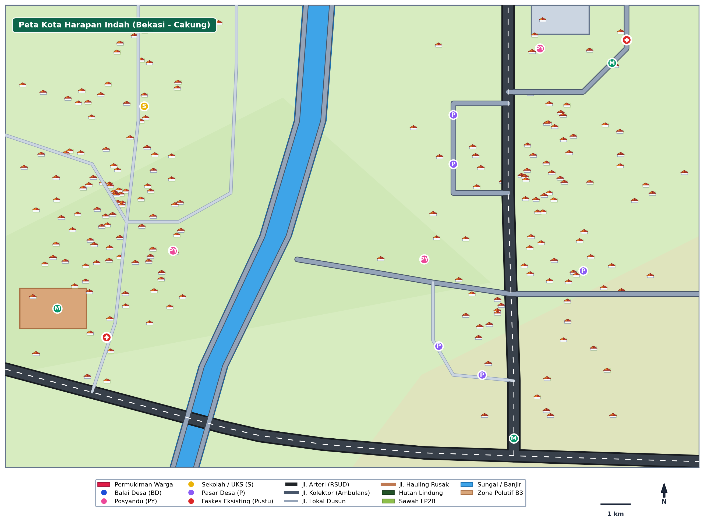
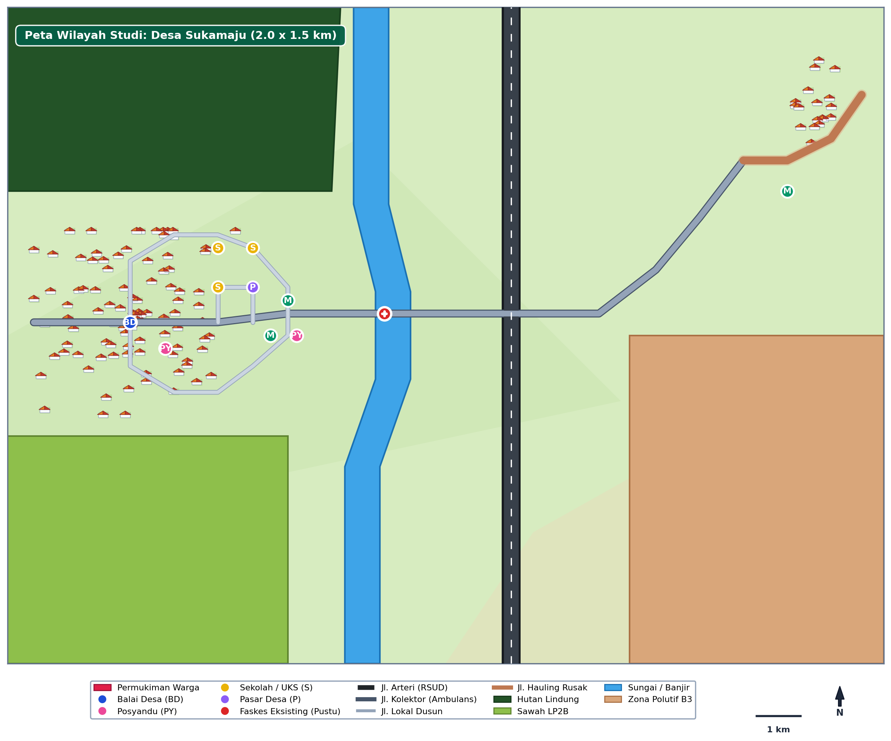
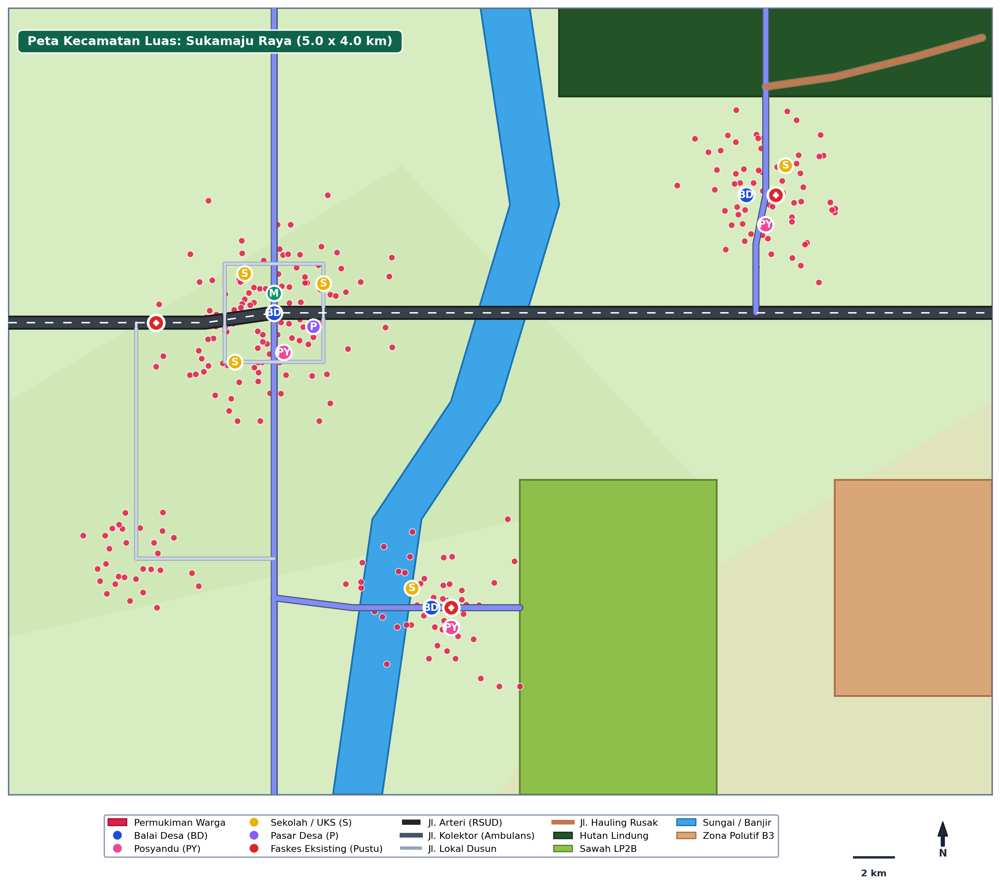
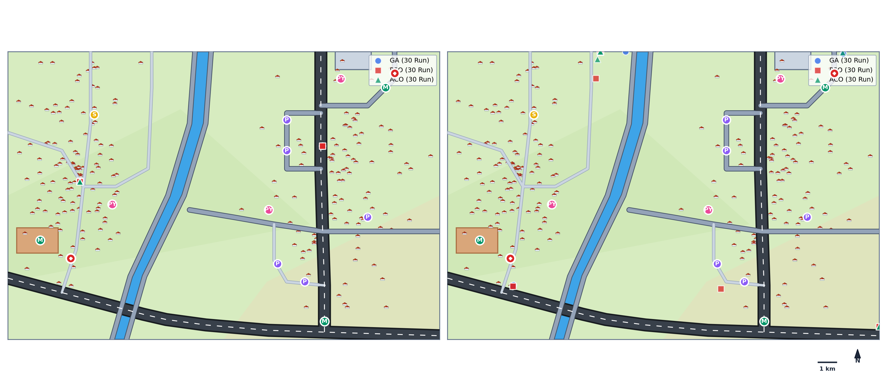
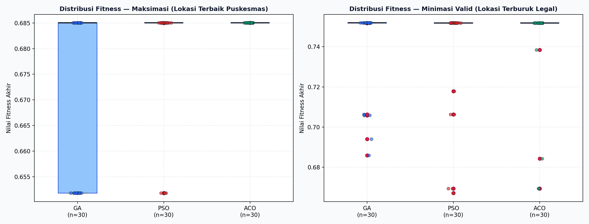
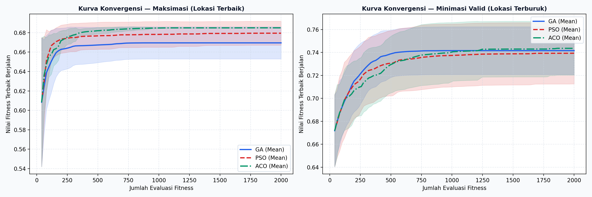
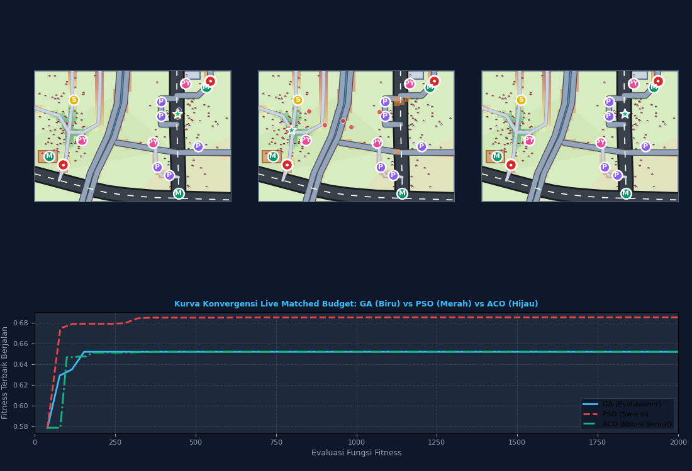
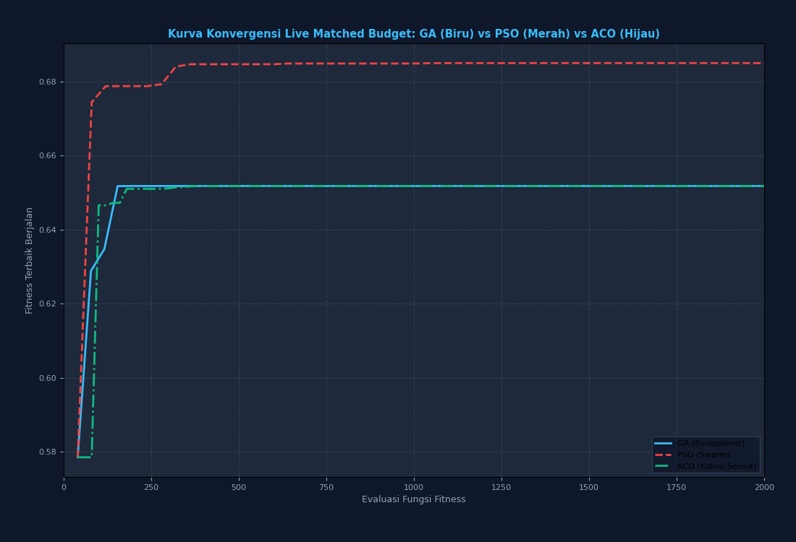
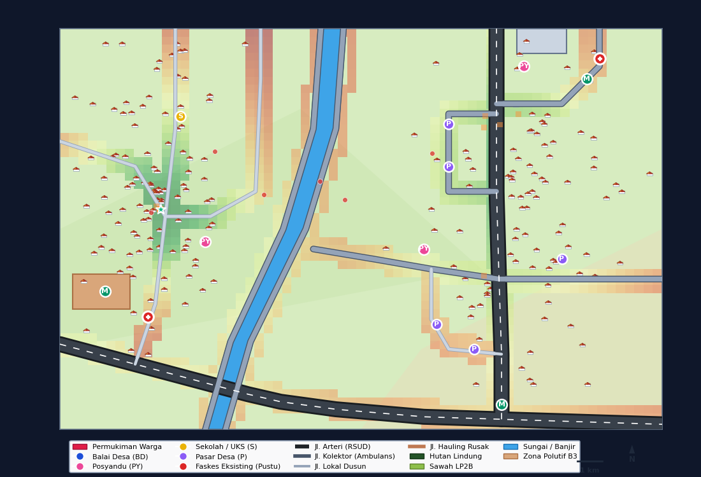

# 🏥 Optimasi Penempatan Fasilitas Puskesmas: Komparasi GA vs PSO vs ACO & OpenStreetMap Web UI

Sistem Pemodelan Spasial dan Komparasi Tiga Algoritma Metaheuristik (*Real-Coded Genetic Algorithm*, *Continuous Particle Swarm Optimization*, dan *Continuous Ant Colony Optimization $\text{ACO}_\mathbb{R}$*) yang dibangun murni dari nol (*from scratch* menggunakan NumPy & Vanilla JS). Proyek ini memecahkan permasalahan **Facility Location Problem (FLP)** fasilitas kesehatan publik (**Pusat Kesehatan Masyarakat / Puskesmas**) dengan dukungan **Web App Terintegrasi OpenStreetMap** yang modern, bersih, dan mudah dipahami.

Mendukung 3 skenario peta spasial:
1. **Peta Kota Harapan Indah (Bekasi - Cakung)** — $2.4\text{ km} \times 1.6\text{ km}$ ($384\text{ Ha}$) dengan **2 Puskesmas Eksisting** (Ujung Menteng & Pejuang) dan Kanal Banjir Timur (BKT).
2. **Peta Wilayah Studi Desa Sukamaju** — $2.0\text{ km} \times 1.5\text{ km}$ ($300\text{ Ha}$) dengan 1 Pustu eksisting.
3. **Peta Regional Kecamatan Luas / OSM Scale** — $5.0\text{ km} \times 4.0\text{ km}$ ($2.000\text{ Ha}$) dengan 3 faskes eksisting.

---

## 📑 Daftar Isi
1. [Latar Belakang & Kasus Kota Harapan Indah](#-latar-belakang--kasus-kota-harapan-indah)
2. [Formulasi Matematis Fungsi Kebugaran & Jaringan Faskes](#-formulasi-matematis-fungsi-kebugaran--jaringan-faskes)
3. [Antarmuka Web Modern Terintegrasi OpenStreetMap](#-antarmuka-web-modern-terintegrasi-openstreetmap)
4. [Arsitektur 3 Algoritma Metaheuristik (From Scratch)](#-arsitektur-3-algoritma-metaheuristik-from-scratch)
5. [Tiga Pemodelan Peta Spasial](#-tiga-pemodelan-peta-spasial)
6. [Hasil Eksperimen Batch 30 Run & Uji Statistik](#-hasil-eksperimen-batch-30-run--uji-statistik)
   - [Peta Kota Harapan Indah (2.4 × 1.6 km)](#kasus-nyata-peta-kota-harapan-indah-24--16-km)
   - [Peta Wilayah Studi Desa (2.0 × 1.5 km)](#peta-wilayah-studi-desa-20--15-km)
   - [Peta Regional Kecamatan Luas (5.0 × 4.0 km)](#peta-regional-kecamatan-luas-50--40-km)
7. [Galeri Visual & Tangkapan Layar](#-galeri-visual--tangkapan-layar)
8. [Panduan Menjalankan Aplikasi & Skrip](#-panduan-menjalankan-aplikasi--skrip)

---

## 🎯 Latar Belakang & Kasus Kota Harapan Indah

Penentuan lokasi fasilitas kesehatan baru di kawasan perbatasan metropolitan **Kota Harapan Indah (Bekasi)** dan **Ujung Menteng / Cakung (Jakarta Timur)** memiliki tantangan spasial yang nyata:
1. **Rintangan Fisik Alami & Kanal BKT**: Sungai besar Banjir Kanal Timur (BKT) / Kali Rawarengas membelah kawasan menjadi sisi barat dan sisi timur. Puskesmas tidak boleh dibangun di dalam badan air atau tanggul sungai.
2. **Kondisi Faskes Eksisting (2 Puskesmas Tersebar)**:
   - **Puskesmas Kelurahan Ujung Menteng** (Sisi Barat, Jakarta Timur, $X = 350\text{ m}, Y = 450\text{ m}$).
   - **Puskesmas Pejuang / Medan Satria** (Sisi Timur Laut, Kota Bekasi, $X = 2150\text{ m}, Y = 1480\text{ m}$).
   - Jarak antar kedua puskesmas eksisting mencapai $\approx 2.05\text{ km}$, menyisakan **kekosongan layanan (service gap)** di tengah koridor komersial dan pemukiman Harapan Indah (Jl. Siliwangi, GrandLucky, COURTS, Bebek Kaleyo).
3. **Pencegahan Kanibalisasi & Keseimbangan Jaringan**: Puskesmas baru wajib menjaga jarak aman ($> 300\text{ m}$) agar tidak terjadi tumpang-tindih anggaran dengan puskesmas eksisting, sekaligus diposisikan di titik keseimbangan jaringan ($d \approx 1.0 - 1.2\text{ km}$ dari kedua puskesmas).

---

## 📐 Formulasi Matematis Fungsi Kebugaran & Jaringan Faskes

Fungsi kebugaran dirumuskan secara aditif berbasis multi-kriteria:

$$\max_{(x, y)} F(x, y) = w_1 S_{\text{pop}}(x, y) + w_2 S_{\text{road}}(x, y) + w_3 S_{\text{fac}}(x, y) + w_4 S_{\text{faskes}}(x, y) - \text{Penalti}(x, y)$$

### 1. Bobot Kriteria Spasial
- **$w_1 = 0.35$ (Aksesibilitas Penduduk / Pasien)**: Peluruhan eksponensial Gauss dari klaster rumah warga ($\sigma = 250\text{ m}$).
- **$w_2 = 0.30$ (Kualitas Jalan Akses Ambulans)**: Mutu jalan ($K_{\text{arteri}}=1.0, K_{\text{kolektor}}=0.85, K_{\text{lokal}}=0.65$) dan jarak tegak lurus ke aspal.
- **$w_3 = 0.20$ (Sinergi Fasilitas Umum)**: Daya tarik sentra publik (GrandLucky, Hotel Santika, Harapan Indah Club, UP PKB Ujung Menteng, Sentra Kuliner Kaleyo/Mang Kabayan).
- **$w_4 = 0.15$ (Kedekatan & Keseimbangan Jaringan Antar-Puskesmas)**:
  $$\text{Ratio} = \frac{d_{\min}}{d_{\text{opt}}}, \quad S_{\text{base}} = \text{Ratio}^{1.5} \exp(1 - \text{Ratio}^{1.5})$$
  Jika terdapat 2 faskes eksisting, dihitung faktor keseimbangan:
  $$\text{Balance} = \frac{\min(d_1, d_2)}{\text{mean}(d_1, d_2)}, \quad S_{\text{faskes}} = 0.70 \cdot S_{\text{base}} + 0.30 \cdot \text{Balance}$$
  Serta penalti kanibalisasi jika jarak $d_{\min} < 250\text{ meter}$.

### 2. Batasan Keras & Penalti Tergradien
- **Zona Terlarang (Badan Air BKT & Sempadan)**: Penalti mutlak $-1000.0$.
- **Koridor Jalan ($\le 50$ meter)**: Wajib menempel badan jalan. Jika $d > 50\text{ m}$, penalti tergradien $-10 - (d - 50)/50$.

---

## 🗺️ Antarmuka Web Modern Terintegrasi OpenStreetMap

Sistem menyediakan aplikasi web interaktif (`web/index.html`) yang tertanam langsung dengan **OpenStreetMap (Leaflet.js)**:

- **Peta Interaktif OpenStreetMap (Kota Harapan Indah)**: Zoom, pan, dan jelajahi langsung kawasan Harapan Indah Bekasi dan Ujung Menteng Cakung dengan layer tile resmi OpenStreetMap.
- **Kartu Metrik KPI Analitik**: Menampilkan koordinat rekomendasi, skor fitness, jarak ke Puskesmas Ujung Menteng & Pejuang, serta persentase keterjangkauan ambulans.
- **Penanda Faskes Eksisting & Radius Cakungan**: Visualisasi 2 Puskesmas eksisting dengan radius jangkauan 800 meter untuk analisis kesenjangan (*service gap*).
- **Simulasi Metaheuristik Multi-Algoritma**: Visualisasi sebaran partikel kandidat GA (biru), PSO (oranye), dan ACO (hijau) yang berkonvergensi secara dinamis di atas peta OpenStreetMap.
- **Inspeksi Spasial Real-Time**: Klik di titik mana saja pada OpenStreetMap untuk mengecek legalitas lahan, jarak ke jalan, jarak ke Puskesmas 1 & 2, serta skor kelayakan tapak.
- **Grafik Konvergensi Langsung**: Kurva garis evaluasi generasi membandingkan GA, PSO, dan ACO secara komparatif.

---

## 🧬 Arsitektur 3 Algoritma Metaheuristik (From Scratch)

Ketiga algoritma dibangun murni dari nol (*NumPy di Python & Vanilla JS di Browser*):
1. **Real-Coded GA**: Tournament selection ($k=3$), BLX-$\alpha$ crossover ($\alpha=0.5$), adaptive Gaussian mutation ($\sigma=40\text{ m}$), dan elitisme ($E=2$).
2. **Continuous PSO**: Dynamic inertia weight decay ($w = 0.9 \to 0.4$), $c_1, c_2 = 1.494$, dan *reflection boundary handling*.
3. **Continuous $\text{ACO}_\mathbb{R}$**: Solution archive $k=40$, *multi-kernel Gaussian PDF*, locality parameter $q=0.35$, dan dispersion rate $\xi=0.70$.

---

## 🗺️ Tiga Pemodelan Peta Spasial

| Parameter | 1. Harapan Indah (Kasus Nyata) | 2. Desa Sukamaju (Studi) | 3. Kecamatan Luas (OSM) |
| :--- | :---: | :---: | :---: |
| **Dimensi** | $2.4\text{ km} \times 1.6\text{ km}$ ($384\text{ Ha}$) | $2.0\text{ km} \times 1.5\text{ km}$ ($300\text{ Ha}$) | $5.0\text{ km} \times 4.0\text{ km}$ ($2.000\text{ Ha}$) |
| **Faskes Eksisting** | **2 Puskesmas** (Ujung Menteng & Pejuang) | 1 Pustu (Sukamukti) | 3 Faskes (Pustu Timur, Selatan, Klinik) |
| **Pemukiman** | 205 klaster rumah | 114 klaster rumah | 275 klaster rumah |
| **Ruas Jalan** | 10 ruas (Arteri Sultan Agung & Boulevard) | 7 ruas | 7 ruas regional |
| **Zona Terlarang** | Badan Air BKT, Danau Retensi, PKB | Sempadan Banjir, LP2B, Tambang | Banjir Sungai, Hutan Lindung, TPA B3 |

| Peta Harapan Indah (Bekasi - Cakung) | Peta Wilayah Studi Desa | Peta Kecamatan Luas |
| :---: | :---: | :---: |
|  |  |  |

---

## 📊 Hasil Eksperimen Batch 30 Run & Uji Statistik

### Kasus Nyata: Peta Kota Harapan Indah (2.4 × 1.6 km)
Dieksekusi 30 run independen dengan matched budget 2.000 evaluasi:

| Mode | Algoritma | Best Fitness | Mean Fitness | Median Fitness | Std Dev | Feasible (%) | Waktu Rata-rata |
| :---: | :---: | :---: | :---: | :---: | :---: | :---: | :---: |
| **MAX** | **GA** | **0.685006** | 0.669517 | 0.685006 | 0.016841 | 100.0% | 2.464 s |
| **MAX** | **PSO** | **0.685006** | 0.679473 | 0.685006 | 0.012580 | 100.0% | **2.272 s** |
| **MAX** | **ACO** | **0.685006** | 0.685006 | 0.685006 | **5.03e-08** | 100.0% | 2.326 s |
| **MIN_VALID**| **GA** | 0.751867 | 0.741620 | 0.751866 | 0.021137 | 100.0% | 2.237 s |
| **MIN_VALID**| **PSO** | 0.751866 | 0.739360 | 0.751860 | 0.027184 | 100.0% | **2.109 s** |
| **MIN_VALID**| **ACO** | 0.751860 | 0.743628 | 0.751822 | **0.023733** | 100.0% | 2.297 s |

- **Rekomendasi Lokasi Optimal**: $(X = 1480.0\text{ m}, Y = 640.0\text{ m})$ pada koridor Jl. Siliwangi / GrandLucky.
  - Berjarak $1.145\text{ m}$ dari Puskesmas Ujung Menteng dan $1.074\text{ m}$ dari Puskesmas Pejuang (posisi simetris ideal).
  - Terhubung langsung ke jalan aspal mutu tinggi ($K=0.85$), ambulans dapat melaju ke arah barat maupun timur tanpa hambatan.
- **Uji Kruskal-Wallis Omnibus**: $H = 6.019, p = 0.0493 < 0.05$ (Signifikan).

| Sebaran Solusi Akhir (Harapan Indah) | Boxplot Distribusi Fitness | Kurva Konvergensi Komparatif |
| :---: | :---: | :---: |
|  |  |  |

---

### Peta Wilayah Studi Desa (2.0 × 1.5 km)
- Best Fitness: **0.932846** (GA, PSO, ACO identik hingga 6 desimal).
- Lokasi Rekomendasi: $(X = 333.7\text{ m}, Y = 786.3\text{ m})$ di tepi Jalan Utama Desa.
- Stabilitas: PSO ($1.57 \times 10^{-10}$) dan ACO ($2.45 \times 10^{-8}$).
- Kruskal-Wallis: $H = 64.825, p = 8.38 \times 10^{-15} < 0.05$.

### Peta Regional Kecamatan Luas (5.0 × 4.0 km)
- Best Fitness: **0.923481** (GA, PSO, ACO).
- Lokasi Rekomendasi: $(X = 1287.7\text{ m}, Y = 2438.4\text{ m})$ pada koridor Jalan Arteri Poros Barat.
- Stabilitas Skala Luas: GA ($6.27 \times 10^{-10}$) dan ACO ($3.28 \times 10^{-8}$) tanpa pernah terjebak lokal optimum.

---

## 🎬 Galeri Visual & Tangkapan Layar

### 1. Antarmuka Desktop Tkinter GUI (Harapan Indah)
| Tampilan Split 3-Algoritma | Layar Penuh Konvergensi |
| :---: | :---: |
|  |  |

| Layar GA Harapan Indah | Layar PSO Harapan Indah | Layar ACO Harapan Indah |
| :---: | :---: | :---: |
|  |  |  |

---

## 💻 Panduan Menjalankan Aplikasi & Skrip

### 1. Menjalankan Aplikasi Web OpenStreetMap (Recommended)
Aplikasi web dapat dibuka langsung di peramban tanpa instalasi server:
```bash
# Opsi A: Jalankan skrip peluncur lokal (otomatis membuka browser)
python run_web.py

# Opsi B: Atau langsung buka file web/index.html di browser Chrome/Edge/Firefox
start web/index.html
```

### 2. Menjalankan Desktop Tkinter GUI
```bash
python app_tkinter.py
```
*Gunakan combobox di panel kiri untuk beralih antara "Peta Kota Harapan Indah", "Peta Wilayah Studi Desa", dan "Peta Kecamatan Luas".*

### 3. Menjalankan Eksperimen Batch & Analisis
```bash
# Batch Harapan Indah
python run_batch.py --map maps/peta_harapan_indah.json --output-dir results_harapan_indah --runs 30 --budget 2000
python analyze.py --results-dir results_harapan_indah --map maps/peta_harapan_indah.json

# Regenerasi Laporan Dokumen Word
python build_docx_report.py
```

### 4. Menjalankan Pengujian Otomatis
```bash
pytest -v
```

---
*Laporan resmi komparasi ilmiah lengkap berformat akademik tersedia di [LAPORAN_OPTIMASI_PUSKESMAS_GA_PSO_ACO.docx](LAPORAN_OPTIMASI_PUSKESMAS_GA_PSO_ACO.docx).*
